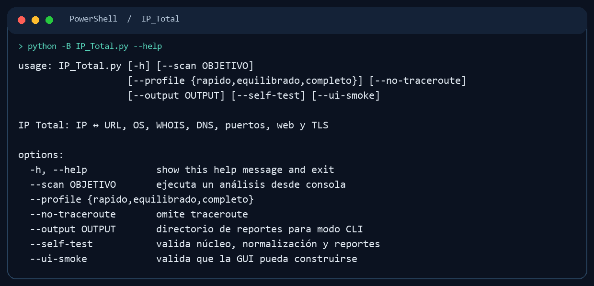

# IP Total

  

**Perfil técnico de una IP o dominio desde GUI o CLI.** Combina resolución IP ↔ URL, DNS, WHOIS, identificación orientativa de sistema operativo, puertos, servicios web y TLS en un reporte reproducible. Reúne señales de reconocimiento que normalmente quedarían dispersas entre varias herramientas.



## Instalación

Requiere Python 3.11 o superior, Tkinter para la interfaz y acceso a las herramientas externas que se quieran utilizar (por ejemplo, Nmap). La disponibilidad de cada prueba depende del sistema y de sus dependencias instaladas.

```powershell
git clone https://github.com/RogerF5-Security/IP_Total.git
cd IP_Total
python -m venv .venv
.\.venv\Scripts\Activate.ps1
python -m pip install -r requirements.txt
```

En Linux instala también el paquete de sistema de Tkinter cuando la distribución no lo incluya y activa el entorno con `source .venv/bin/activate`.

## Uso

```powershell
python IP_Total.py --help
python IP_Total.py --self-test
python IP_Total.py                                    # GUI
python IP_Total.py --scan 192.0.2.10 --profile rapido --no-traceroute --output .\audit_reports
```

`192.0.2.10` es una dirección de ejemplo; sustitúyela por un activo del alcance aprobado. Los perfiles disponibles son `rapido`, `equilibrado` y `completo`. La CLI guarda reportes HTML y JSON en `audit_reports/` o en la ruta indicada con `--output`. En consolas Windows antiguas, usa `chcp 65001` o `PYTHONIOENCODING=utf-8` si los caracteres de ayuda no se muestran bien.

## Componentes

- `IP_Total.py`: GUI y comandos.
- `ip_total_core.py`: normalización, pruebas y reportes.
- `IPtoOS.py` / `IPtoURL.py`: utilidades complementarias.
- [LEEME_IP_Total.md](LEEME_IP_Total.md): notas de operación.

## Alcance y licencia

Este repositorio no declara todavía una licencia de reutilización. Úsalo exclusivamente en entornos controlados y auditorías autorizadas. Los resultados de identificación son indicios que requieren corroboración manual.
